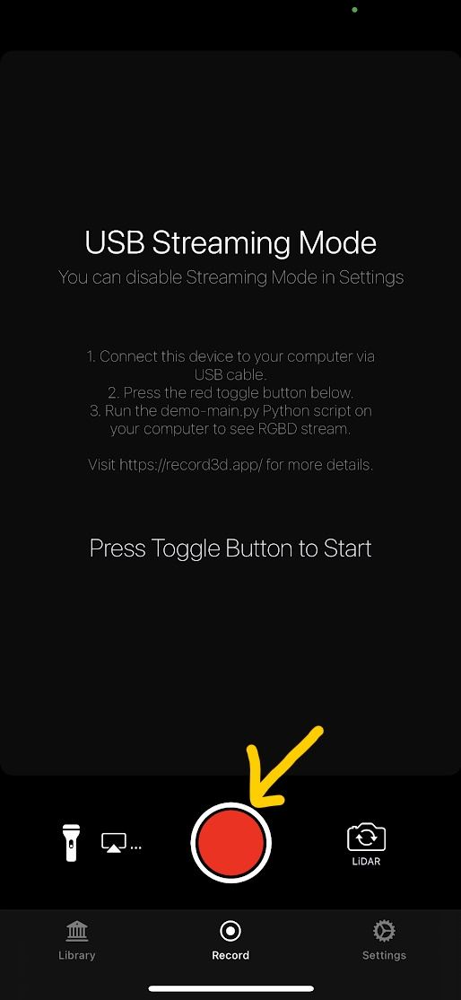

# iPhone RGBD Recorder

## Environment

### Hardware

    * iPhone 12 Pro/Pro Max
    * Windows PC


### iPhone App

    * Record3D 1.6.1

### PC Software

    * Windows 10
    * Python 3.8.10
    * Python Package
        - opencv-python 4.5.3.56
        - record3d 1.3.0
        - open3d 0.13.0

## Install

### iPhone

* Install the Record3D app from the App Store.

    https://apps.apple.com/jp/app/record3d-3d-videos/id1477716895

### PC

* Install Python

    https://www.python.org/downloads/windows/

* Git Clone and Install Package

```bash
git clone https://github.com/ylabo0717/iPhone-RGBD-Recorder.git
cd iPhone-RGBD-Recorder
pipenv sync
pipenv shell
```

## Usage

### Recording

1. [iPhone] Connect your iPhone to your PC via USB.

2. [iPhone] Launch the Record3D app on your iPhone.

    

3. [iPhone] Change Record3D Settings

    

| item  |  value  |
| :-: | :-: |
| Live RGBD Video Streaming  | USB |
| Higher quality LiDAR recording  | ON (Optional) |


4. [iPhone] Start Recording

    

5. [PC] Execute Recoder on your PC.

```bash
python iphone_rgbd_recorder.py
```

6. [PC] Press the 'r' key in the RGBD Viewer window to start recording.

### Visualize

```bash
python visualizer.py <data path>
```

### 3D Reconstrucion (VoxelHashingGUI)

```
./VoxelHashingGUI.bat <data path>
```


