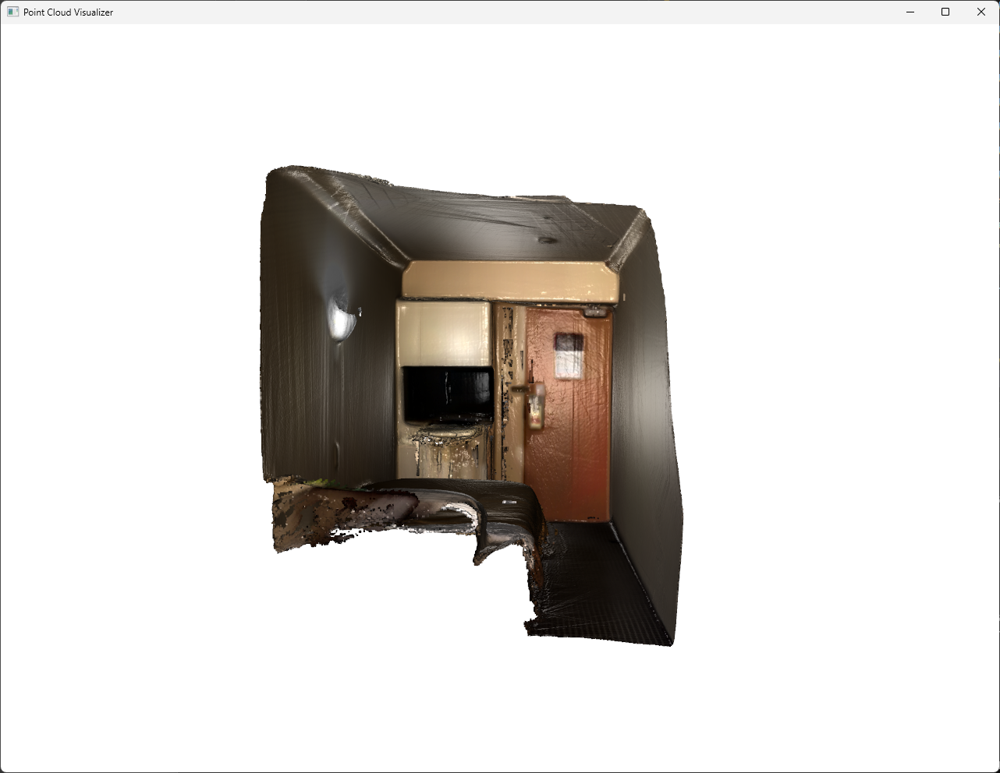

# 3D Reconstruction with iPhone and Open3D

This is a toolchain for 3D Reconstruction with iPhone 14 Pro/Pro Max.   
Tools for recording RGB-D data and 3D reconstruction are provided.

## Demo

[](https://www.youtube.com/watch?v=mg64PCfr1u8)

## 3D Model Example

https://skfb.ly/opuAL


## Environment

### Hardware

* iPhone 14 Pro/Pro Max or 15 Pro/Pro Max
* Windows PC

### iPhone App

* [Record3D](https://apps.apple.com/jp/app/record3d-3d-videos/id1477716895) 1.6.1

### PC Software

* Windows 10
* Python 3.10
* Python Package
    - [opencv-python](https://github.com/opencv/opencv) 4.8.1
    - [record3d](https://github.com/marek-simonik/record3d) 1.3.1
    - [open3d](https://github.com/isl-org/Open3D) 0.17.0
    - [numpy](https://numpy.org/) 1.26.2

## Installation

### iPhone

* Install the Record3D app from the App Store.

    https://apps.apple.com/jp/app/record3d-3d-videos/id1477716895

### PC

* Install Python

    https://www.python.org/downloads/windows/


* Git Clone and Install Package

    ```bash
    git clone --recursive https://github.com/ylabo0717/iPhone-3D-Reconstruction.git
    # You can also update the submodule manually
    git submodule update --init --recursive
    ```

* Install Package (Sync Virtual Envirioment)

    ```bash
    cd iPhone-3D-Reconstruction
    pip install -r requirements.txt
    ```

## Usage

### 1. Recording

  * [Recording with iPhone + Record3D](./doc/recording_with_record3d.md)

    Recorded data is stored as follows.

    ```
    data
    └── yyyy-mm-dd_HHMMSS
    ```

    If you wish to use the sample data without recording, please download and extract the data below.

    https://drive.google.com/file/d/15BpnsuWo2beH8rNDpTC-3vjyt6cv0q4B/view?usp=sharing

### 2. 3D Reconstruction

* Open3D Reconstruction System

    Run the following command.

    ```bash
    ./Reconstruction.bat <data path>

    # example
    ./Reconstruction.bat ./data/2022-12-25_153726
    ```

    The integrated.ply file will be saved in <data path>/scene/ folder.

    ```
    data
    └── yyyy-mm-dd_HHMMSS
        └── scene.ply
    ```


* Open3D OnlineSLAM

    Download the bellow zip file and extract it.  

    https://drive.google.com/file/d/13MgkJvk39FLkLzzEL6TDKsKE8dVlcF6l/view?usp=sharing

    ```
    <This directory>
    └── Release
    |     OfflineSLAM.exe
    |     OnlineSLAMRGBD.exe
    └── resources
    ```

    Run the following command.

    ```bash
    # CPU
    ./OnlineSLAM.bat <data path>

    # CUDA
    ./OnlineSLAM_cuda.bat <data path>

    # example
    ./OnlineSLAM.bat ./data/2022-12-25_153726
    ```

    Click the [Pause/Resume] switch.

    

    Close the application when SLAM is finished.
    The scene.ply file will be saved in <data path> folder.

    ```
    data
    └── yyyy-mm-dd_HHMMSS
        └── scene.ply
    ```


Run the following command.

```bash
./visualizer_pcd.py <point cloud data path>

# example
python ./visualizer_pcd.py ./data/2022-12-25_153726/scene/integrated.ply
```




For more information, please visit the following website.
http://www.open3d.org/docs/latest/tutorial/Basic/visualization.html


## License

Distributed under the MIT License. See [LICENSE](./LICENSE) for more information.
