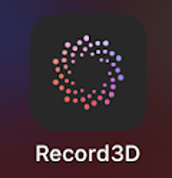
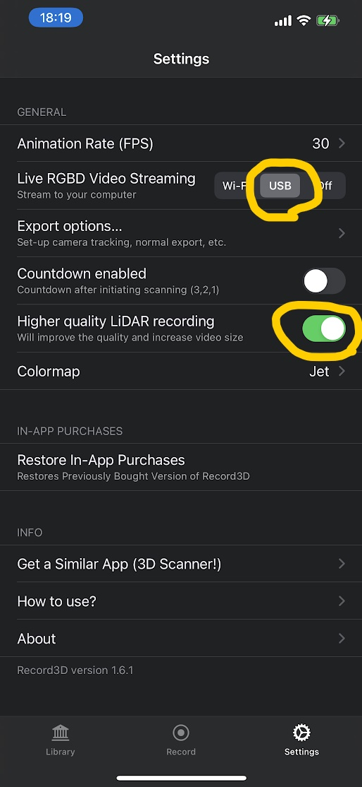
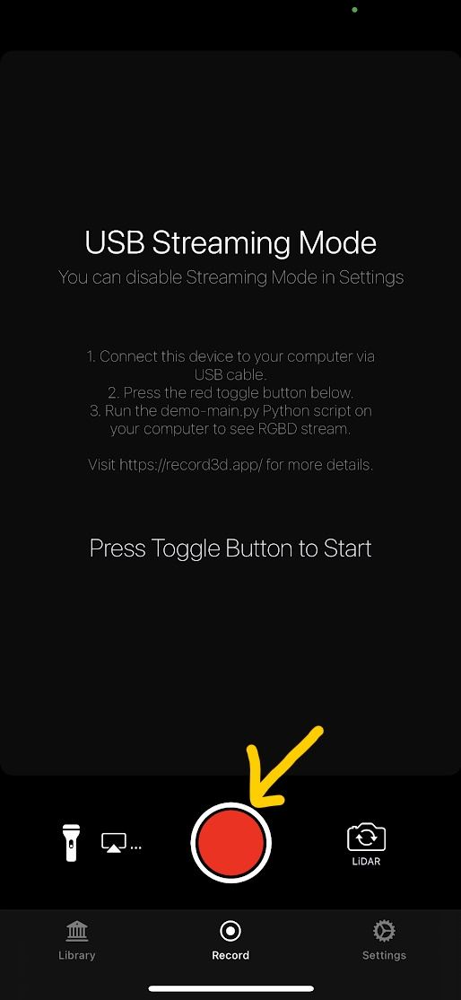

Recording with iPhone + Record3D
=============

1. [iPhone] Connect your iPhone to your PC via USB.

2. [iPhone] Launch the Record3D app on your iPhone.

    

3. [iPhone] Change Record3D Settings

    

| item  |  value  |
| :-: | :-: |
| Live RGBD Video Streaming  | USB |
| Higher quality LiDAR recording  | ON (Optional) |


4. [iPhone] Start Recording

    

5. [PC] Execute Recoder on your PC.

    ```bash
    python iphone_rgbd_recorder.py
    ```

6. [PC] Press the 'r' key in the RGBD Viewer window to start recording.

7. [PC] Press the 'r' key again to finish recording.

    The color and depth images are saved in ./data/yyyy--mm-dd_HHMMSS folder that can be used for Open3D Reconstruction System.

    ```
    data
    └── yyyy-mm-dd_HHMMSS
        ├── camera_intrinsic.json
        ├── color
        │   ├── 000000.jpg
        │   ├── :
        └── depth
            ├── 000000.png
            ├── :
    ```
